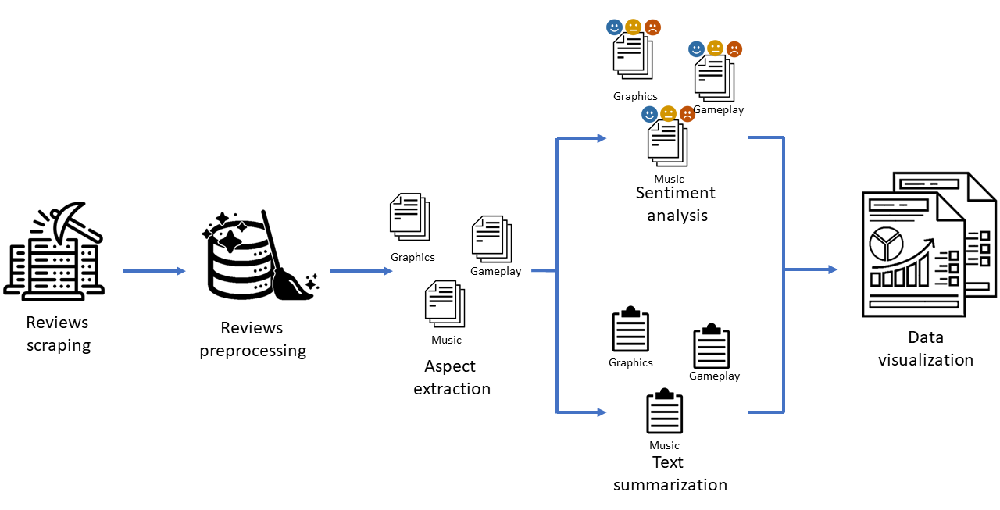
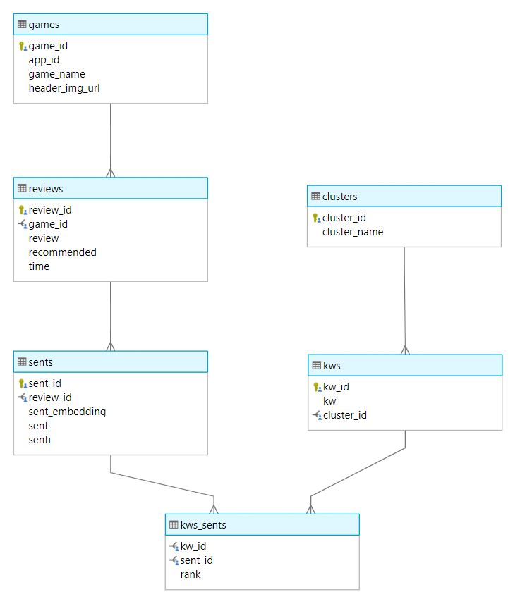
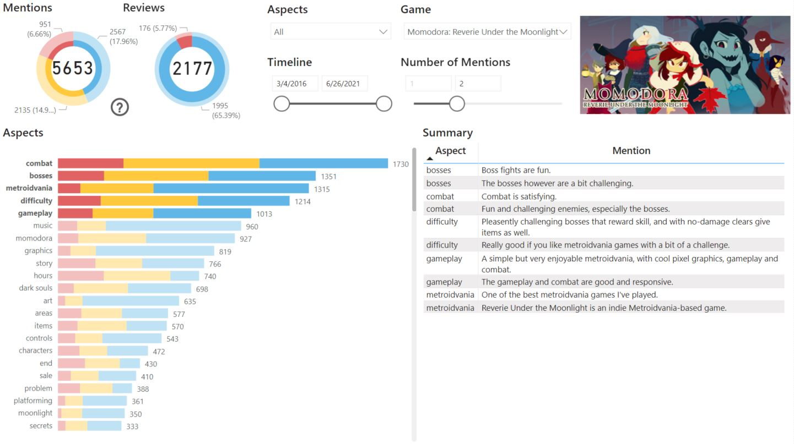
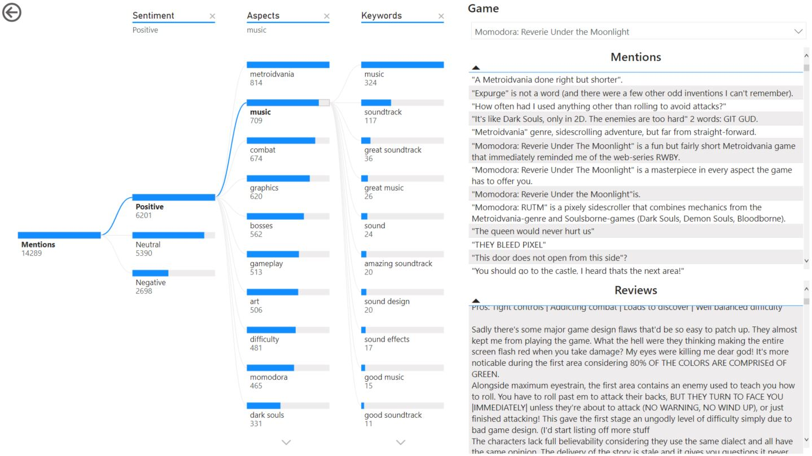

# Steam Insider: A Machine Learning System for Aspect-Based Sentiment Analysis and Text Summarization of Video Game Reviews on Steam

The system was created as part of my bachelor thesis. The thesis can be read in details [here](Thesis%-%20210913.pdf).

Steam Insider is an unsupervised machine learning system for aspect-based sentiment analysis, text summarization, and data
visualization of video game reviews on Steam. 

The system uses a simple rule-based approach to extract the most important keywords from a game’s user reviews and cluster
them into groups, which are called aspects. We then perform sentiment analysis on each
sentence that belongs to an aspect using a pre-trained RNN-based sentiment classifier.
Based on reader’s preferences like aspects, polarities, time, etc., certain sentences are
extracted, and then clustering methods are used to identify salient opinions and generate
a customizable extractive summarization. A dashboard for visualizing the results and
further complex analyses is also created.

The unsupervised system shows great usefulness and efficiency, which can potentially be applied to other domains like mobile app,
product, hotel or restaurant reviews, etc.

## Installation
Create new Python 3.6 environment, change directory to this repo and type the following line:

```
pip install -r requirement.txt
```
Do note that it's my working environment so there might be some unused packages.

The entire pipeline can be found in this [file](Steam%Insider%Pipeline.ipynb).

## Overview


*Figure 1: System overview*

The pipeline of our system in Figure 1 works as follows:

- **Reviews scraping**: Collect the reviews of a game using the reviews scraper. 
- **Reviews preprocessing**: Preprocess the reviews and split each of them into
sentences. These sentences also need to be cleansed and filtered as some contain
inappropriate symbols or structures which will decrease the effectiveness of our
system in the later steps.
- **Aspect extraction**: Use a heuristic-based approach that utilizes part-of-speech
(POS) tagging and certain rules to extract keywords (or keyphrases). We then compute 
the sentence embeddings of each extracted keyword using [SBERT (Sentence-BERT)](https://arxiv.org/abs/1908.10084), and apply agglomerative clustering to cluster similar ones together into
groups, which are called aspects. Keywords are also extracted together with the
sentences in which they are found so these sentences can be used in the subsequent
steps.

The two following components come after aspect extraction and can be performed simultaneously:
- **Sentiment analysis**: Use a pre-trained RNN-based sentiment classifier to classify
the sentences found in the previous step as _positive_, _negative_, or _neutral_.
- **Text summarization**: For each aspect, apply SBERT to compute the sentence
embeddings and use a combination of HDBSCAN and agglomerative clustering
to cluster sentences. We then find the sentence lying closest to the center of each
cluster and call it an opinion. We rank the opinions by the size of their clusters and
pick out the 5 most popular opinions. We assume that the bigger the cluster, the
more popular an opinion is. And thus for each extracted aspect from the previous
step, we have a list of the 5 most important opinions, which will act as a summary
for that aspect.

The last step utilizes the output from the previous steps, which is saved into an SQL
database model:
- **Data visualization**: Connect Power BI to our database model and put together
interactive dashboards that help us visualize and perform further complex analysis
with time, aspects, keywords, etc.

## Database Model


*Figure 2: ER Diagram of our system*

## Data Visualization
At the last step, we used Power BI to create a dashboard which consists of two pages:
- **Overview page**: Figure 3 shows the Overview page of our dashboard. This is the page the user will
come into contact with first upon using the dashboard. It shows the most important
information about a game such as the total number of sentences (we call them mentions
in this case), the total number of reviews, the sentiment among different aspects, and
the summary which composes of the most important mentions for each aspect. Blue is for positive sentiment, 
red is for negative, and yellow is for neutral. 



*Figure 3: Overview page of the dashboard*

- **Mention Analysis page**: Figure 4 shows the Mention Analysis page of our dashboard.
by clicking the question mark symbol in the mentions overview. It helps us inspect the
mentions by sentiment, aspects, or keywords. 



*Figure 4: Mention Analysis page of the dashboard*
